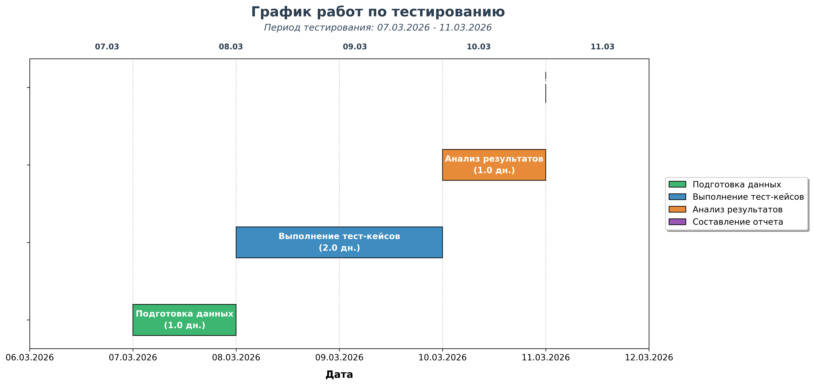

# Тест-план: GET /products/{productId}/status

**Версия:** 1.0  
**Дата:** 06.03.2026  
**Автор:** Пугачев Андрей  

---

## 1. Введение

### 1.1 Цель тестирования
Проверка корректности работы REST API эндпоинта `GET /products/{productId}/status` в соответствии с требованиями спецификации.

### 1.2 Область применения
Документ предназначен для команды тестирования и разработки. Определяет объем, подход, ресурсы и график тестирования указанного эндпоинта.

### 1.3 Ссылки на исходные документы
Техническое задание на разработку API 
Спецификация API (OpenAPI/Swagger)

---

## 2. Объект тестирования (Что надо тестировать?)

REST API эндпоинт `GET /products/{productId}/status`.  
Параметры запроса:

- `authToken` (обязательный) - 16 символов, буквы + цифры
- `recalculate` (опциональный)
- `owner` (опциональный)
- `region` (опциональный)

Параметры `recalculate`, `owner` и `region` **не коррелируют** между собой.

---

## 3. Что будете тестировать? (Объем тестирования)

### 3.1 Что тестируемо
Проверке подлежат следующие функциональные области:

- Авторизация и аутентификация с использованием параметра `authToken`
- Обработка параметра `recalculate` (true/false/null)
- Обработка параметра `owner` (Создатель/Пользователь/null)
- Обработка параметра `region` (Северо-Запад/Сибирь/Поволжье)
- Комбинации независимых параметров `recalculate`, `owner` и `region`
- Обработка идентификатора продукта `productId` (корректные/некорректные значения)
- Коды ответов HTTP (200, 401, 404, 405, 500)
- Структура тела ответа (JSON)

### 3.2 Что не тестируемо
- Нагрузочное тестирование
- Тестирование безопасности (кроме базовой аутентификации)
- Производительность API
- Интеграция со смежными системами

---

## 4. Как будете тестировать? (Стратегия тестирования)

### 4.1 Методы тестирования
- **Функциональное тестирование** - проверка корректности работы согласно спецификации
- **Негативное тестирование** - передача некорректных данных
- **Граничное тестирование** - проверка граничных значений параметров

### 4.2 Техники тест-дизайна
- **Классы эквивалентности и граничные значения** - для проверки длины и формата `authToken` (15, 16, 17 символов, только буквы, только цифры, буквы+цифры, спецсимволы)
- **Попарное тестирование (Pairwise)** - для проверки комбинаций параметров `recalculate`, `owner` и `region`
- **Предугадывание ошибок**  - проверка сценариев, которые вызовут ошибку

### 4.3 Таблица попарного тестирования

| Комбинация | recalculate | owner | region |
|------------|-------------|-------|--------|
| 1 | true | Создатель | Северо-Запад |
| 2 | true | Пользователь | Сибирь |
| 3 | true | null | Поволжье |
| 4 | false | Создатель | Поволжье |
| 5 | false | Пользователь | Северо-Запад |
| 6 | false | null | Сибирь |
| 7 | null | Создатель | Сибирь |
| 8 | null | Пользователь | Поволжье |
| 9 | null | null | Северо-Запад |

### 4.4 Инструменты тестирования
- **Postman** - для отправки HTTP-запросов и проверки ответов
- **cURL** - для быстрой проверки в терминале
- **Баг-трекинг система** (Jira/YouTrack/Redmine) - для регистрации дефектов

---

## 5. Когда будете тестировать? (Расписание и этапы)

### 5.1 Календарный график работ

| Этап | Описание | Начало | Окончание | Длительность |
|------|----------|--------|-----------|--------------|
| 1 | Подготовка тестовых данных | 07.03.2026 | 07.03.2026 | 1 день |
| 2 | Выполнение тест-кейсов | 08.03.2026 | 09.03.2026 | 2 дня |
| 3 | Анализ результатов, регистрация багов | 10.03.2026 | 10.03.2026 | 1 день |
| 4 | Составление отчета о тестировании | 11.03.2026 | 11.03.2026 | 0.5 дня |

### 5.2 Диаграмма Ганта

### 5.3 Контрольные точки (Milestones)

| Контрольная точка | Дата | Статус |
|-------------------|------|--------|
| Готовность тестовых данных | 07.03.2026 | Ожидается |
| Завершение выполнения тест-кейсов | 09.03.2026 | Ожидается |
| Завершение анализа результатов | 10.03.2026 | Ожидается |
| Готовность отчета | 11.03.2026 | Ожидается |

---

## 6. Критерии начала тестирования

- Разработан и утвержден план тестирования
- Созданы и утверждены тест-кейсы
- Развернут тестовый стенд с доступом к API
- Настроены инструменты тестирования (Postman, коллекции)
- Подготовлены тестовые данные (валидные/невалидные токены, productId)
- Закончена разработка требуемого функционала
- Наличие всей необходимой документации
- Известны валидные значения `productId` для продуктов со статусами "Готов" и "Не готов"

---

## 7. Критерии приостановки и возобновления тестирования

### 7.1 Критерии приостановки
- Обнаружен критический дефект, блокирующий дальнейшее тестирование
- Недоступность тестового стенда
- Отсутствие необходимых тестовых данных

### 7.2 Критерии возобновления
- Критический дефект исправлен
- Тестовый стенд восстановлен
- Тестовые данные предоставлены

---

## 8. Критерии окончания тестирования

- Выполнены все запланированные тест-кейсы
- Критические дефекты исправлены и проверены
- Нет блокирующих дефектов
- Все найденные дефекты задокументированы в баг-трекинговой системе
- Требования к количеству открытых багов выполнены
- Выдержан период Code Freeze (CF) без изменения кода
- Выдержан период Zero Bug Bounce (ZBB) без открытия новых багов

---

## 9. Окружение тестируемой системы

- **Тестовый стенд:** доступ к API по адресу `https://test-api.example.com`
- **Программно-аппаратные средства:** ПК с ОС Windows/Linux/macOS, браузер
- **Инструменты:** Postman, cURL
- **Клиент:** любое устройство с доступом к API

---

## 10. Необходимое оборудование и программные средства

- ПК с доступом в интернет
- Установленный Postman (или альтернативный HTTP-клиент)
- Доступ к баг-трекинговой системе
- Тестовые данные (коллекции запросов, переменные окружения)

---

## 11. Ресурсы и график

### 11.1 Ресурсы
- **Тестировщик:** 1 человек (Пугачев Андрей)
- **Оборудование:** ПК с доступом в интернет

### 11.2 График
- **Начало тестирования:** 07.03.2026
- **Окончание тестирования:** 10.03.2026
- **Сдача отчета:** 11.03.2026

---

## 12. Результаты тестирования (артефакты)

По итогам тестирования будут созданы следующие документы:

- **Тест-кейсы** — набор проверок
- **Баг-репорты** — по каждому найденному дефекту
- **Отчет о тестировании** — итоговый документ с результатами

---

## 13. Риски и пути их разрешения

| Риск | Вероятность | Влияние | Меры по сокращению |
|------|-------------|---------|---------------------|
| Недоступность тестового стенда | Средняя | Высокое | Согласовать время доступа заранее, иметь локальное окружение |
| Некорректная спецификация API | Низкая | Среднее | Уточнять требования у аналитика/разработчика |
| Нехватка времени | Средняя | Среднее | Приоритизировать тест-кейсы, выполнять критические сначала |
| Ошибки в тестовых данных | Низкая | Среднее | Валидировать данные перед началом тестирования |
| Изменение требований в процессе | Низкая | Высокое | Поддерживать тест-план в актуальном состоянии, проводить рецензии |

---

## 14. Состав тест-кейсов

План включает **31 тест-кейс**, разбитых на следующие разделы:

| Раздел | Название | Количество |
|--------|----------|------------|
| 1 | Позитивные сценарии | 4 |
| 2 | Авторизация и аутентификация | 8 |
| 3 | Проверка параметров (негатив) | 4 |
| 4 | Граничные случаи и ошибки | 5 |
| 5 | Комбинаторика | 4 |
| 6 | Дополнительные проверки | 6 |

---