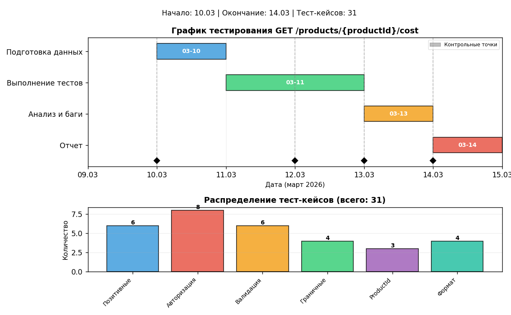

# Тест-план: GET /products/{productId}/cost

**Версия:** 1.0  
**Дата:** 10.03.2026  
**Автор:** Пугачев Андрей

---

## 1. Введение

### 1.1 Цель тестирования
Проверка корректности работы REST API эндпоинта GET /products/{productId}/cost в соответствии с требованиями спецификации. Метод предназначен для расчета стоимости продукта с учетом количества уже приобретенных экземпляров.

### 1.2 Область применения
Документ предназначен для команды тестирования и разработки. Определяет объем, подход, ресурсы и график тестирования указанного эндпоинта.

### 1.3 Ссылки на исходные документы
- Техническое задание на разработку API
- Спецификация API (OpenAPI/Swagger)
- Таблица стоимости продукта

---

## 2. Объект тестирования (Что надо тестировать?)

REST API эндпоинт `GET /products/{productId}/cost`

**Параметры запроса:**
- `productId` (path parameter) — идентификатор продукта
- `authToken` (обязательный) — 16 символов, буквы + цифры
- `count` (обязательный) — количество запрашиваемых экземпляров (целое число ≥ 0)
- `start` (обязательный) — индекс, с которого начинать расчет (количество уже купленных)

**Таблица стоимости:**
| Количество приобретенных | 1 | 2 | 3 | 4 | 5 |
|:------------------------:|:-:|:-:|:-:|:-:|:-:|
| Стоимость | 30 | 25 | 20 | 15 | 10 |

**Правила расчета:**
- Стоимость рассчитывается нарастающим итогом
- При count > 5 расчет идет партиями по 5 экземпляров

---

## 3. Что будете тестировать? (Объем тестирования)

### 3.1 Что тестируемо
Проверке подлежат следующие функциональные области:

| № | Область | Описание |
|:--:|:--------|:---------|
| 1 | Авторизация | Проверка параметра authToken (валидный/невалидный/отсутствует) |
| 2 | Валидация параметров | Проверка корректности значений count и start |
| 3 | Расчет стоимости | Проверка математической корректности вычислений |
| 4 | Обработка граничных значений | Минимальные и максимальные значения параметров |
| 5 | Обработка productId | Корректные и некорректные значения |
| 6 | Коды ответов HTTP | 200, 400, 401, 404, 500 |
| 7 | Структура ответа | Формат JSON (cost, errorMessage) |

### 3.2 Что не тестируемо
- Нагрузочное тестирование
- Тестирование безопасности (кроме базовой аутентификации)
- Производительность API
- Интеграция со смежными системами
- Клиентские приложения

---

## 4. Как будете тестировать? (Стратегия тестирования)

### 4.1 Методы тестирования
| Метод | Применение |
|:------|:-----------|
| Функциональное тестирование | Проверка корректности расчета стоимости согласно таблице |
| Негативное тестирование | Передача некорректных данных (невалидный токен, отрицательные значения) |
| Граничное тестирование | Проверка граничных значений count и start (0, 1, 5, 1000) |
| Параметризованное тестирование | Проверка различных комбинаций start и count |

### 4.2 Техники тест-дизайна
| Техника | Применение |
|:--------|:-----------|
| Классы эквивалентности | Проверка длины и формата authToken (15, 16, 17 символов, только буквы, только цифры, буквы+цифры, спецсимволы) |
| Граничные значения | Проверка count = 0, 1, 5, 6; start = -1, 0, 4, 5 |
| Анализ таблицы решений | Проверка расчета стоимости для разных комбинаций start и count |
| Предугадывание ошибок | Проверка сценариев, которые могут вызвать ошибки |

### 4.3 Инструменты тестирования
| Инструмент | Назначение |
|:-----------|:-----------|
| Postman | Отправка HTTP-запросов и проверка ответов |
| cURL | Быстрая проверка в терминале |
| Python + requests | Автоматизация тестирования |
| Баг-трекинг система (Jira/YouTrack) | Регистрация дефектов |

---

## 5. Когда будете тестировать? (Расписание и этапы)

### 5.1 Календарный график работ
| Этап | Описание | Начало | Окончание | Длительность |
|:----:|:---------|:------:|:---------:|:-------------|
| 1 | Подготовка тестовых данных | 10.03.2026 | 10.03.2026 | 1 день |
| 2 | Выполнение тест-кейсов | 11.03.2026 | 12.03.2026 | 2 дня |
| 3 | Анализ результатов, регистрация багов | 13.03.2026 | 13.03.2026 | 1 день |
| 4 | Составление отчета о тестировании | 14.03.2026 | 14.03.2026 | 0.5 дня |

### 5.3 Диаграмма Ганта

### 5.2 Контрольные точки (Milestones)
| Контрольная точка | Дата | Статус |
|:------------------|:----:|:-------|
| Готовность тестовых данных | 10.03.2026 | Ожидается |
| Завершение выполнения тест-кейсов | 12.03.2026 | Ожидается |
| Завершение анализа результатов | 13.03.2026 | Ожидается |
| Готовность отчета | 14.03.2026 | Ожидается |

---

## 6. Критерии начала тестирования

-  Разработан и утвержден план тестирования
-  Созданы и утверждены тест-кейсы
-  Развернут тестовый стенд с доступом к API
-  Настроены инструменты тестирования (Postman, коллекции)
-  Подготовлены тестовые данные (валидные/невалидные токены, productId)
-  Закончена разработка требуемого функционала
-  Наличие всей необходимой документации
-  Известны валидные значения productId для тестирования

---

## 7. Критерии приостановки и возобновления тестирования

### 7.1 Критерии приостановки
- Обнаружен критический дефект, блокирующий дальнейшее тестирование
- Недоступность тестового стенда (более 4 часов)
- Отсутствие необходимых тестовых данных

### 7.2 Критерии возобновления
- Критический дефект исправлен
- Тестовый стенд восстановлен
- Тестовые данные предоставлены

---

## 8. Критерии окончания тестирования

-  Выполнены все запланированные тест-кейсы (100%)
-  Нет критических (Critical) и блокирующих (Blocker) дефектов
-  Все найденные дефекты задокументированы в баг-трекинговой системе
-  Процент успешных тестов ≥ 95%
-  Выдержан период Code Freeze (CF) без изменения кода
-  Выдержан период Zero Bug Bounce (ZBB) без открытия новых багов

---

## 9. Окружение тестируемой системы

| Компонент | Значение |
|:----------|:---------|
| Тестовый стенд | https://test-api.example.com |
| Операционная система | Windows 11 / Ubuntu 22.04 |
| Инструменты | Postman, cURL, Python |
| Клиент | Любое устройство с доступом к API |
| Баг-трекинг система | Jira / YouTrack |

---

## 10. Необходимое оборудование и программные средства

- ПК с доступом в интернет
- Установленный Postman (или альтернативный HTTP-клиент)
- Доступ к баг-трекинговой системе
- Тестовые данные (коллекции запросов, переменные окружения)
- Git для хранения тестовой документации

---

## 11. Ресурсы и график

### 11.1 Ресурсы
| Роль | ФИО | Количество |
|:-----|:----|:-----------|
| Тестировщик | Пугачев Андрей | 1 человек |

### 11.2 Оборудование
- ПК с доступом в интернет

### 11.3 График
| Событие | Дата |
|:--------|:----:|
| Начало тестирования | 10.03.2026 |
| Окончание тестирования | 13.03.2026 |
| Сдача отчета | 14.03.2026 |

---

## 12. Результаты тестирования (артефакты)

По итогам тестирования будут созданы следующие документы:

| Артефакт | Описание |
|:---------|:---------|
| Тест-кейсы | Набор проверок в табличной форме |
| Баг-репорты | Документация по каждому найденному дефекту |
| Отчет о тестировании | Итоговый документ с результатами и метриками |

---

## 13. Риски и пути их разрешения

| Риск | Вероятность | Влияние | Меры по сокращению |
|:-----|:-----------:|:-------:|:-------------------|
| Недоступность тестового стенда | Средняя | Высокое | Согласовать время доступа заранее, иметь локальное окружение |
| Некорректная спецификация API | Низкая | Среднее | Уточнять требования у аналитика/разработчика |
| Нехватка времени | Средняя | Среднее | Приоритизировать тест-кейсы, выполнять критические сначала |
| Ошибки в тестовых данных | Низкая | Среднее | Валидировать данные перед началом тестирования |
| Изменение требований в процессе | Низкая | Высокое | Поддерживать тест-план в актуальном состоянии |
| Сложность расчета стоимости | Средняя | Высокое | Создать эталонные расчеты для всех комбинаций |

---

## 14. Состав тест-кейсов

План включает **31 тест-кейс**, разбитых на следующие разделы:

| Раздел | Название | Количество |
|:------:|:---------|:----------:|
| 1 | Позитивные сценарии (расчет стоимости) | 6 |
| 2 | Авторизация и аутентификация | 8 |
| 3 | Валидация параметров count и start | 6 |
| 4 | Граничные значения | 4 |
| 5 | Обработка productId | 3 |
| 6 | Проверка формата ответа | 4 |

### Детализация тест-кейсов

#### Раздел 1: Позитивные сценарии (расчет стоимости)
| № | productId | authToken | start | count | Ожидаемый результат |
|:-:|:---------|:----------|:-----:|:-----:|:--------------------|
| 1.1 | 1 | Валидный | 0 | 5 | 100 (30+25+20+15+10) |
| 1.2 | 1 | Валидный | 2 | 2 | 35 (20+15) |
| 1.3 | 1 | Валидный | 0 | 3 | 75 (30+25+20) |
| 1.4 | 1 | Валидный | 4 | 1 | 10 |
| 1.5 | 1 | Валидный | 5 | 5 | 100 (новая партия) |
| 1.6 | 1 | Валидный | 2 | 4 | 70 (25+20+15+10) |

#### Раздел 2: Авторизация и аутентификация
| № | productId | authToken | start | count | Ожидаемый код |
|:-:|:---------|:----------|:-----:|:-----:|:-------------:|
| 2.1 | 1 | Отсутствует | 0 | 5 | 401 |
| 2.2 | 1 | Пустой ("") | 0 | 5 | 401 |
| 2.3 | 1 | 15 символов | 0 | 5 | 401 |
| 2.4 | 1 | 17 символов | 0 | 5 | 401 |
| 2.5 | 1 | Только буквы | 0 | 5 | 401 |
| 2.6 | 1 | Только цифры | 0 | 5 | 401 |
| 2.7 | 1 | Спецсимволы | 0 | 5 | 401 |
| 2.8 | 1 | Кириллица | 0 | 5 | 401 |

#### Раздел 3: Валидация параметров count и start
| № | productId | authToken | start | count | Ожидаемый код |
|:-:|:---------|:----------|:-----:|:-----:|:-------------:|
| 3.1 | 1 | Валидный | отсутствует | 5 | 400 |
| 3.2 | 1 | Валидный | 0 | отсутствует | 400 |
| 3.3 | 1 | Валидный | -1 | 5 | 400 |
| 3.4 | 1 | Валидный | 0 | -1 | 400 |
| 3.5 | 1 | Валидный | 0 | 0 | 400 или 0? |
| 3.6 | 1 | Валидный | "abc" | 5 | 400 |

#### Раздел 4: Граничные значения
| № | productId | authToken | start | count | Ожидаемый результат |
|:-:|:---------|:----------|:-----:|:-----:|:--------------------|
| 4.1 | 1 | Валидный | 0 | 1 | 30 |
| 4.2 | 1 | Валидный | 4 | 1 | 10 |
| 4.3 | 1 | Валидный | 5 | 1 | 30 |
| 4.4 | 1 | Валидный | 0 | 1000 | Расчет по партиям |

#### Раздел 5: Обработка productId
| № | productId | authToken | start | count | Ожидаемый код |
|:-:|:---------|:----------|:-----:|:-----:|:-------------:|
| 5.1 | 999 (несущ) | Валидный | 0 | 5 | 404 |
| 5.2 | 0 | Валидный | 0 | 5 | 404 |
| 5.3 | -1 | Валидный | 0 | 5 | 400 или 404 |

#### Раздел 6: Проверка формата ответа
| № | Сценарий | Ожидаемый ответ |
|:-:|:---------|:----------------|
| 6.1 | Успешный запрос | `{ "cost": 100 }` |
| 6.2 | Ошибка 401 | `{ "errorMessage": "Unauthorized" }` |
| 6.3 | Ошибка 404 | `{ "errorMessage": "Product not found" }` |
| 6.4 | Ошибка 400 | `{ "errorMessage": "Invalid parameters" }` |

---

